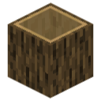

#  Bark Blocks

## Features

### Blocks

This mod adds bark blocks, a new type of wooden block. When you strip a log with silk touch, you now get a bark block of the corresponding wood type. Bark blocks are hollow through one axis, leaving only a two-pixel-thick ring. As they are hollow, you can stand or crawl inside them and they can also be waterlogged.

### worldgen

In 1.21.5, Mojang added fallen trees to java edition: This mod adds a 1/5 chance to replace fallen trees with a hollow variant - made from bark blocks.

## Setup

### Compiling (Optional)

Compiled jar files are available under releases - if you intend to use these then you can ignore this. I suggest using them unless you are familiar with mod development or otherwise understand what you are doing.

Your IDE of choice may be able to be used for this; otherwise, your terminal of choice. Using an IDE requires [setup](https://docs.fabricmc.net/develop/getting-started/setting-up). In any case, run the runDatagen task then the build task. The output jar should be located as <nobr>'build/libs/bark-blocks-\<version\>.jar'</nobr>.

<sub>Note: there may also be a jar file of similar name <nobr>'bark-blocks-\<version\>-sources.jar'</nobr>, which can be ignored.</sub>

### Installing

This mod uses the fabric modloader. If you need help installing fabric, please see [here](https://docs.fabricmc.net/players/installing-fabric/). As with any fabric mod, simply place the jar file into the mods folder - See [here](https://docs.fabricmc.net/players/installing-mods) if you need help.

<sub>Note: this mod depends on the fabric API, a separate mod released by fabric.</sub>

## See also

### Versioning

As with most minecraft mods, semantic versioning isn't well suited.
Minecraft in unusual in that older version are still played frequently, especially when modded.
Thus it makes sense for modders to target a range of minecraft version as opposed to just the latest.
So I'm going to throw in my two cents here.

The version will look like ```<feature>.<update>.<patch>+<minecraft-version>```
and pre-release versions will be indicated by adding ```-<pre-release>``` before the ```+```.

- ```<feature>``` incremented when features are added/removed/replaced/et cetera
- ```<update>``` incremented when ported to a new minecraft version - should mostly just be technical changes but may include some player facing changes if consequential of the new minecraft version
- ```<patch>``` incremented when bugfixes are made
- ```<minecraft-version>``` indicates the supported minecraft versions (changes with each ```<update>```), may indicate
  - A single minecraft version
  - A range of versions: ```<lower>-<upper>``` where ```<lower>``` is oldest minecraft version and ```<upper>``` is the newest
  - All subsequent versions: ```<first>+``` where ```<first>``` is the first suported minecraft version
    - Will need to be replaced with a range if a new minecraft update breaks compatibility
- ```<pre-release>``` may be ```<stage>.<build-number>``` where
  - ```<stage>``` is ```a``` for alpha, ```b``` for beta or ```rc``` for release candidate
  - ```<build-number>``` is incremented for each build within the same ```<stage>```

### Other

[LICENSE](LICENSE)

[Fabric](https://fabricmc.net/)

[Finding Trustworthy Mods](https://docs.fabricmc.net/players/finding-mods)

Thank You!